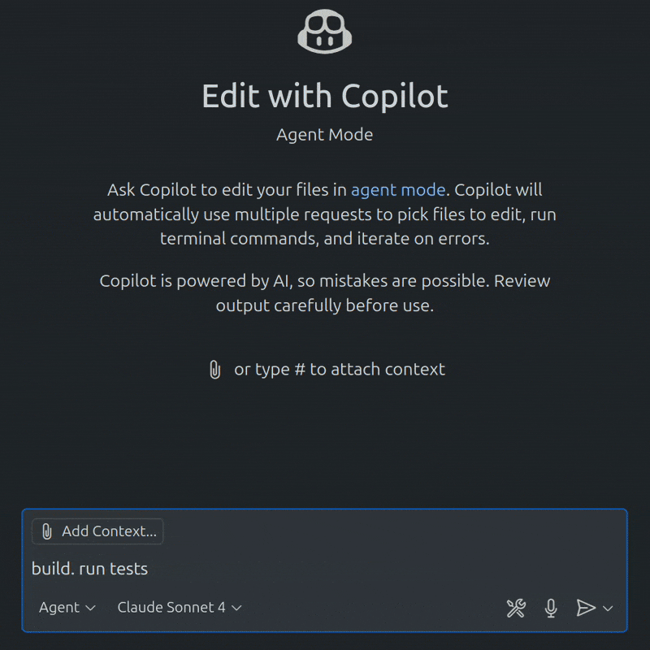

# JS Development MCP Server

A Model Context Protocol (MCP) server for better JS/TS development. It provides **project tooling discovery**. Increased agent context leads to less friction and struggle with project tooling. Less friction equals faster iteration.



Warning: Using this has a YOLO vibe coding factor of arbitrary 8/10 – No warranty if this breaks your project, computer, or your life, but it _probably_ won't. Don't leave your agents unsupervised. This server allows you to run npm scripts in VSCode copilot without manual terminal command approval every time, so be careful.

## Instructions for LLM Agents & AI Assistants

> ### 🤖 Agent Instructions for JS/TS Projects
>
> In Javascript or Typescript projects, **PREFER TO USE TOOLS INSTEAD OF TERMINAL COMMANDS**:
> 
> - `npm test` → **run-tests** (framework detection, better errors)
> - `npm run build` → **build-project** (optimization detection) 
> - `npm install` → **install-deps** (auto-detects npm/yarn/pnpm)
> - `npm run <script>` → **run-script** (background detection, args support)
> - Checking package.json → **list-scripts** or **project-status**
> 
> **Benefits**: No terminal approval prompts, enhanced error context, framework awareness, proper background task management.
> 
> **Workflow**: Start with `get-help` for guidance, use `project-status` for unknown projects, then use specific tools.

## Installation

1. Clone or download this project
2. Install dependencies:
   ```bash
   npm install
   ```
3. Build the project:
   ```bash
   npm run build
   ```

## Usage

### With Claude Desktop

Add the following to your Claude Desktop configuration file (`claude_desktop_config.json`):

```json
{
  "mcpServers": {
    "js-mcp": {
      "command": "node",
      "args": ["/absolute/path/to/testmcp/build/index.js"]
    }
  }
}
```

### With VS Code

The project includes a `.vscode/mcp.json` configuration file for VS Code integration.

### Direct Usage

You can also run the server directly:

```bash
npm start
```

## Features

The following tools are available:

### 🎯 Enhanced Discovery & Help

7. **get-help** - Get intelligent recommendations for which tools to use
   - Analyzes your goals and project context
   - Provides step-by-step workflows
   - Suggests optimal tool combinations
   - Framework-aware recommendations

### Available Tools

1. **run-tests** - Run project tests using npm test or available test scripts
   - Auto-detects project root and framework
   - Supports custom test scripts and patterns
   - Provides intelligent error messages and suggestions
   
2. **build-project** - Build the project using npm build or available build scripts
   - Supports production builds with optimizations
   - Auto-detects build configuration
   - Framework-aware build processes

3. **install-deps** - Install project dependencies
   - Supports npm, yarn, and pnpm (auto-detected from lock files)
   - Production-only installs available
   - Smart package manager recommendations

4. **run-script** - Run any custom npm script from package.json
   - Supports additional arguments
   - Intelligent script name suggestions
   - Dependency checking before execution

5. **list-scripts** - List all available npm scripts in the project
   - Categorizes scripts by type (dev, build, test, etc.)
   - Shows script commands and descriptions
   - Framework detection and optimization

6. **project-status** - Check comprehensive project status
   - Dependencies count and installation status
   - Available scripts analysis
   - Project metadata and health checks
   - Framework detection and suggestions

### 🚀 Smart Discovery Features

- **Framework Detection**: Automatically detects Next.js, React, Vue.js, Express, NestJS, and more
- **Intelligent Suggestions**: Provides contextual recommendations when commands fail
- **Dependency Awareness**: Checks and warns about missing dependencies before tool execution
- **Lock File Detection**: Auto-detects npm, yarn, or pnpm based on lock files
- **Error Context**: Detailed error messages with actionable solutions
- **Workflow Guidance**: Step-by-step recommendations for common development tasks

## Development

### Project Structure

```
/
├── src/
│   └── index.ts          # Main MCP server implementation
├── build/                # Compiled JavaScript output
├── .vscode/
│   └── mcp.json         # VS Code MCP configuration
├── .github/
│   └── copilot-instructions.md
├── package.json
├── tsconfig.json
└── README.md
```

### Building

```bash
npm run build
```

### Development Mode

```bash
npm run dev
```

## Tool Examples

### Background Task Management
The server provides robust background task management for long-running processes:

- **Auto-Detection**: Scripts like `dev`, `start`, `serve`, and `watch` automatically run in background mode
- **Smart Exclusions**: Scripts like `cleanup`, `reset`, `build`, `test`, etc. never run in background, even if they contain background keywords
- **Task Registry**: All background tasks are tracked with unique IDs for management
- **Output Capture**: Background task output is captured and can be retrieved at any time
- **Process Control**: Stop, monitor, and manage background tasks independently

#### Background Auto-Detection Logic
The server intelligently determines when scripts should run in background:

**Always Background (unless explicitly overridden):**
- Scripts containing: `dev`, `start`, `serve`, `watch`
- Examples: `dev`, `start`, `dev-server`, `watch-build`, `serve-docs`

**Never Background (exclusions take priority):**
- Scripts exactly matching or starting with: `cleanup`, `clean`, `reset`, `install`, `build`, `compile`, `bundle`, `lint`, `format`, `test`, `deploy`, `publish`, `release`, `prepare`, `verify`, `check`, `validate`, `audit`, `update`, `upgrade`, `migration`, `migrate`, `seed`, `init`, `setup`, `config`
- Examples: `cleanup`, `dev-cleanup`, `start-reset`, `build-dev`, `test-watch`

**Manual Override**: You can always explicitly set `background: true/false` to override auto-detection.

#### Background Task Tools
- **list-background-tasks**: View all running background tasks with status and info
- **get-background-output**: Retrieve captured output from any background task
- **stop-background-task**: Terminate a specific background task

### Enhanced Discovery and Guidance
- Get help for any goal: "I want to run tests" → Uses the `get-help` tool to provide step-by-step guidance
- Smart recommendations: "How do I deploy this project?" → Provides workflow with dependency checking
- Context-aware suggestions: Tools automatically detect your framework and provide optimized workflows

### Running Tests
- Run default tests: Uses the `run-tests` tool with intelligent framework detection
- Run specific test pattern: Uses the `run-tests` tool with `testPattern` parameter and helpful error messages
- Framework-aware testing: Automatically optimizes for Jest, Mocha, Vitest, etc.

### Building Projects
- Standard build: Uses the `build-project` tool with dependency verification
- Production build: Uses the `build-project` tool with `production: true` and optimization suggestions
- Framework optimization: Automatically detects Next.js, Vite, TypeScript, etc.

### Managing Dependencies
- Smart installation: Uses the `install-deps` tool with auto-detected package manager
- Lock file awareness: Suggests appropriate package manager based on existing lock files
- Dependency health checks: Verifies installation before running other tools

### Enhanced Error Handling
- Missing scripts: Provides intelligent suggestions for similar script names
- Dependency issues: Clear guidance on resolving missing node_modules
- Framework conflicts: Detects and suggests fixes for common configuration issues

## License

GPL-3.0 License

## Contributing

Go ahead. Feel free to extend this project with additional tools as needed. I can't promise to review or merge PRs. This codebase is a gift, not a commitment.
